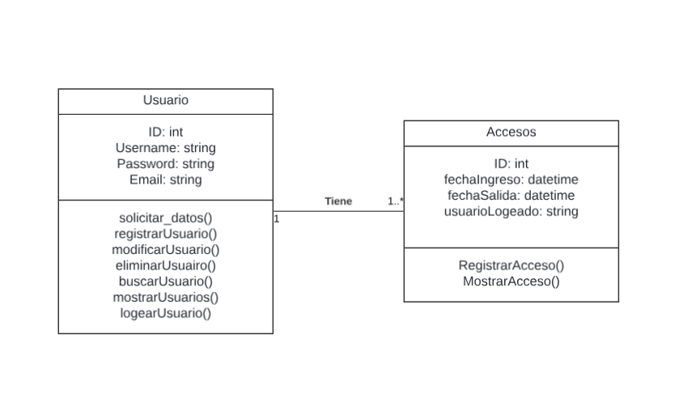

# Evidencia 2

Este proyecto implementa un sistema básico de gestión de usuarios para un kiosco, utilizando Python. El sistema permite registrar, modificar, eliminar y buscar usuarios, así como registrar accesos al sistema.

## Características

- Registro de usuarios
- Modificación de datos de usuarios
- Eliminación de usuarios
- Búsqueda de usuarios
- Visualización de todos los usuarios registrados
- Sistema de login
- Registro de accesos al sistema

## Requisitos

- Python 3.x 🐍

No es necesario instalar ninguna biblioteca adicional, ya que el programa utiliza módulos de la biblioteca estándar de Python.

## Cómo ejecutar el programa

1. Asegúrate de tener Python 3.x instalado en tu sistema.
2. Descarga los archivos `clases.py` y `principal.py` en el mismo directorio.
3. Abre una terminal o línea de comandos.
4. Navega hasta el directorio donde guardaste los archivos.
5. Ejecuta el siguiente comando:

   ```
   python principal.py
   ```

6. Sigue las instrucciones en pantalla para interactuar con el sistema.

## Estructura del proyecto

- `clases.py`: Contiene las definiciones de las clases `Usuario` y `Acceso`, así como funciones auxiliares para manejar archivos binarios.
- `principal.py`: Contiene la función `main()` que implementa el menú principal y la lógica de interacción con el usuario.
- `usuarios.ispc`: Archivo binario que almacena los datos de los usuarios (se crea automáticamente).
- `accesos.ispc`: Archivo binario que almacena los registros de acceso al sistema (se crea automáticamente).
- `logs.txt`: Archivo de texto que registra los intentos de inicio de sesión (se crea automáticamente).
  
## Diagrama UML de clases.

   

## Posibles inconvenientes y soluciones

1. **Problema de importación de módulos**: Si al ejecutar el programa aparece un error de importación, asegúrate de que ambos archivos (`clases.py` y `principal.py`) estén en el mismo directorio.

2. **Errores de permisos**: Si el programa no puede crear o modificar los archivos `usuarios.ispc`, `accesos.ispc` o `logs.txt`, asegúrate de tener permisos de escritura en el directorio donde estás ejecutando el programa.

3. **Problemas con la codificación de caracteres**: Si ves caracteres extraños al mostrar información en la consola, asegúrate de que tu terminal esté configurada para usar UTF-8.

## Mejoras futuras

- Implementar una interfaz gráfica para una mejor experiencia de usuario.
- Añadir encriptación para las contraseñas almacenadas.
- Implementar un sistema de roles y permisos para los usuarios.
- Agregar funcionalidades específicas para la gestión del kiosco (inventario, ventas, etc.).

## Contribuciones

Las contribuciones son bienvenidas. Por favor, abre un issue para discutir los cambios propuestos antes de realizar un pull request.

## Licencia

Este proyecto está bajo la licencia MIT. Consulta el archivo `LICENSE` para más detalles.
